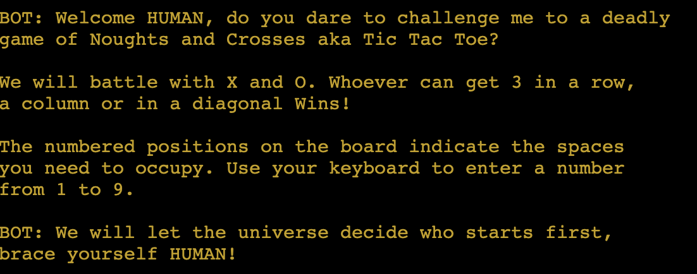
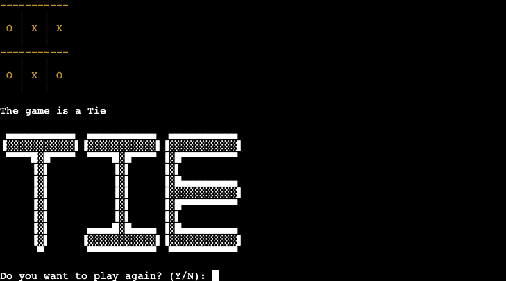
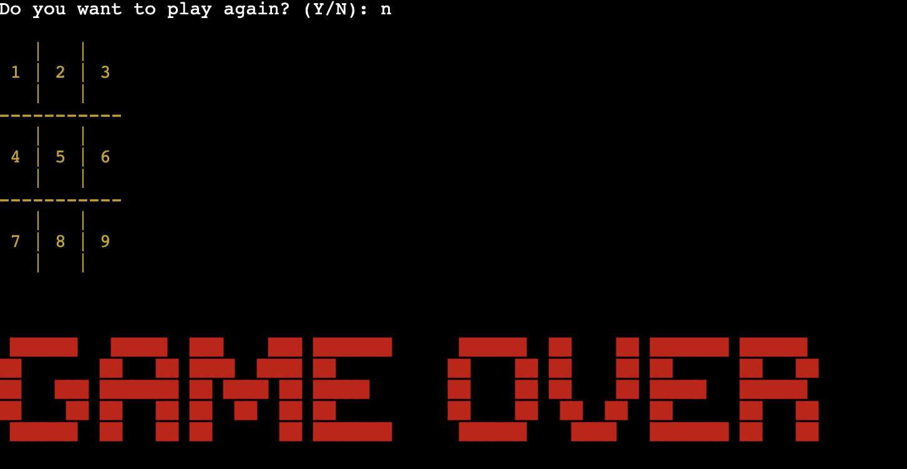
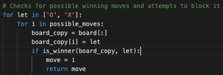
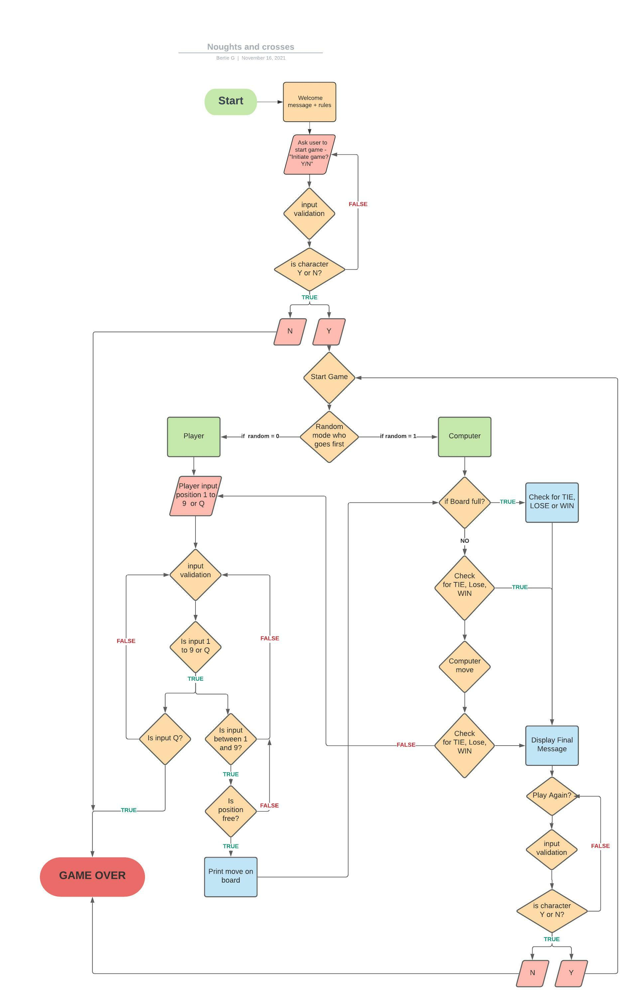
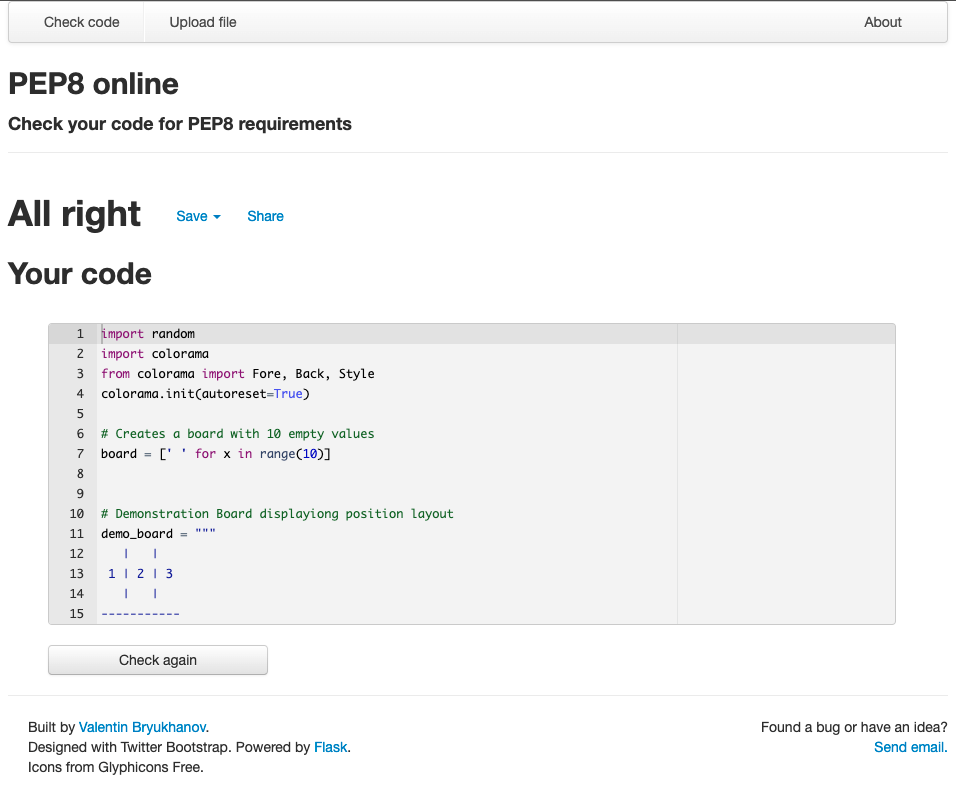
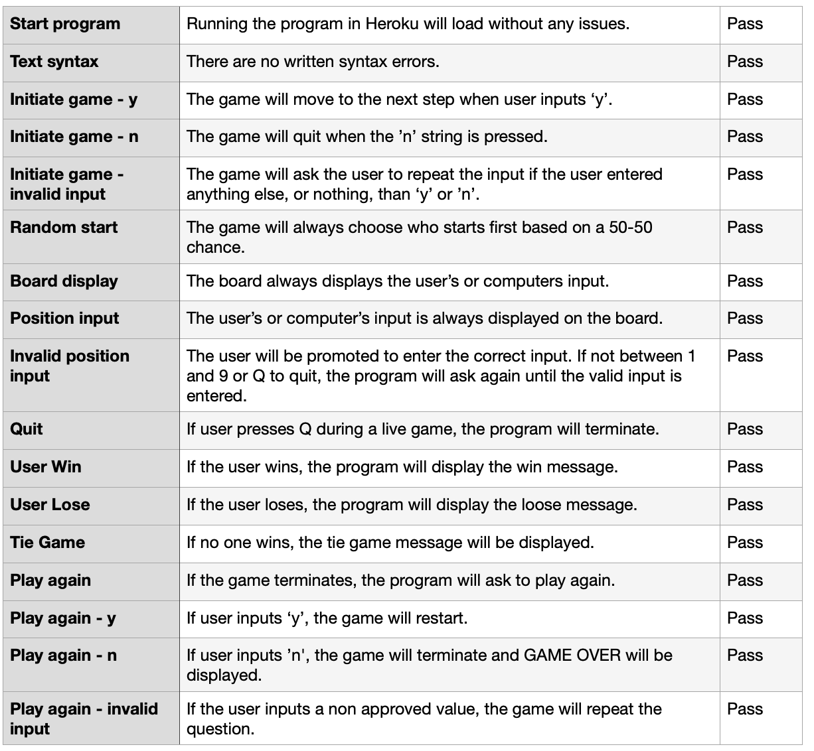

# Noughts and Crosses aka Tic Tac Toe

Live website [here](https://noughts-and-crosses-ag.herokuapp.com/).
 

# Introduction

Welcome to the famous game of Noughts and Crosses aka Tic Tac Toe for US users.
This game is played between a player (HUMAN) and the computer (BOT). 
This game is played by entering X and O in one of the nine positions.  There are three possible outcomes for the user. Win, Lose or Tie.

The board has spaces labeled from 1 to 9 starting with 1 at the top left and 9 bottom right corner.

To win, a player has to enter 3 of the same symbols in the same row, or column or diagonal. Whoever does that first wins.

The start of this program is determined by the "who goes first" function, meaning that the function chooses randomly a number between 0 and 1. The 0 is allocated to the Player(HUMAN) and the 1 to the Computer(BOT).

As you might know, the easiest way to win at the game is to capture the corners, hence why the BOT was programmed to check for the corners first for availability, then the center and lastly the center of the outer edges.

The BOT will try and block any potential wins for the player.

If the board gets filled and no one wins, the programm will assume it's a TIE.

The player can quit at any time if they input 'Q'.

  

## <a name="top">Table of Contents</a>

### [1. User Experience](#user-ex) 

- Design Approach
- User Expectations
	- New Users
	- Returning Users
	- Frequent Users
- Color Design
### [2. Features](#features)
- Interactive Gameplay
- Input Validation
- Game Colour Features & ASCII Art
- End of the Game
- Code Features

### [3. Wireframe](#wireframe)
### [4. Testing](#manual-testing)
- PEP8 Validator
- Manual Testing
### [5. Technologies Used](#tech-used)
### [6. Deployment](#deployment)
### [7. Bugs](#bugs)
- Known Fixed Bugs
- Existing Bugs
### [8. Credits](#credits)

  

[Top of the page](#top)
# <a name="user-ex">1. User Experience</a>

## Design Approach 

The UX design was developed with the idea of keeping everything simple and straight forward but with some added featuers such as the colour scheam and ASCII messages.

Originally the program was designed to be played between two real users, however I have soon realized that this was a bit too simple and not as entertaining as if a computer "AI" element was introduced. I found that this has made the UX a lot more enjoyable. 
  

## User Expectation

The main goal of this game is to challenge the user to use their strategic abilities to win a board game. The game will need to be clear from the begining.

 

- ### A new user:
	A new use will understand the purpose and the rules of the game as soon as the game initiates.
	The rules are displayed straight away at the beginning of the game. It explains to the user how to play the game, it displays a demonstration board with the positions and it asks the user if they want to initiate the game.

 

- ### A returning user:
	A returning user will know how to :
	- initiate the game
	- quit the game
	- play the game
	- restart the game

 

- ### A frequent user:
	A frequent user would want to know:
	- If any new graphical images have been uploaded.
	- if any graphics have changed or been updated.

 

[Top of the page](#top)

## Color Design

Since this program is designed to challenge and entertain, I have decided to add the Gold colour in as it contrasts with the black background and makes the text more vibrant. 

The red colour is used to underline a problem with the user's inputs and also to indicate that the player has lost.  
 

Since the ASCII Art for "YOU LOSE" is meant to replicate running 'blood' I have also chosen the red colour for it as it would add drama.  

  

[Top of the page](#top)

# <a name="features">2. Features</a>
## Interractive Gameplay
The user will play against a computer. The computer will choose different positions on the board depending on the user's previous input. The moves are not always the same.

## Input Validation
The user has a choice of various inputs. If the user enters a string or a number, not within the range then the following message will appear, prompting the user to try again.

- "Initiate the game? (Y/N):"  
	

- "Place your 'X' HUMAN (position 1 - 9) or press 'Q' to give up :" 
	

[Top of the page](#top)

## Game Colour Features & ASCII Art
The game has different colour features and additional ASCII Art for a better contrast and visual appeal.

- Game Intro
	

- "You WON"
	

- "Bot is the winner"
	

- "The game is a tie"
	

 

[Top of the page](#top)

## End of the Game

The user has the option to play again at the end of each game or quit the game all together.

[Top of the page](#top)
## Code Features

- The "flip a coin start" is a small code which allows the program to decide who goes first. It's a very simple piece of code, but it playes a big part in the running of the program and UX. If the code picks 0 then the player will start first, else it will be the computer. 
 
Player starts first code. 
 
Computer starts first code.
  

- The Computer will block a possible winning move. 
	 
In this code the program makes a copy of the board and uses the player's inputs to see if it can win on the next move. If yes, then it will enter it's own symbol in the possible winning position.

  

[Top of the page](#top)
## <a name="wireframe">3. Wireframe</a>
The wireframe was created using Lucidchart.

  

[Top of the page](#top)
## <a name="wireframe">4. Testing</a>

### PEP8 Validator

The program passes the PEP8 Validator without any issues.

  

[Top of the page](#top)
### Manual Testing

  

[Top of the page](#top)
## <a name="tech-used">5. Technologies used</a>

For the creation of this game I have used the following resources:

- Github: to store the repository.
- Gitpod: to write the code.
- Slack: to ask for advice from other students.
- Stack Overflow: to search for bug fixes.
- PEP8: for making sure the code remains compliant.
- [Colorama](https://pypi.org/project/colorama/) ANSI escape character sequences have long been used to produce colored terminal text and cursor positioning on Unix and Macs.
- Youtube: for code explanation.
- Google: searching for various troubleshooting and inspiration.
- patorjk.com: for the ASCII Art.
- inventwithpython.com: for the inspiration of the program's development approach.

  

[Top of the page](#top)

## <a name="deployment">6. Deployment</a>

To deploy the project, I have used the cloud platform Heroku. 

These are the steps I took for the deployment:
- make sure the lastest pushed version of the repository is uploaded to Github.
- create a Heroku account.
- select "New" on the right hand corner, and "Create new app".
- in the new page, enter the App name making sure it's available, in my case noughts-and-crosses-ag.
- choose the reagion, in my case Europe.
- select the "Deployment method", in my case Github.
- then below, select the repo-name from the Github repository, noughts-and-crosses.
- select 'Search' and it will be linked automatically.
- click the "Connect" button. 
- now click "Enable Automatic Deploys"
- now on the top bar select "Settings"
- look for "Add Buildpack" and select python first, press "Save changes" then repeat the process again and select nodejs in this  exact order.
- now click on "Personal" on the top left corner.
- click on noughts-and-crosses-ag 
- click "Open App" on the top right corner.
- the project is now deployed.

  

[Top of the page](#top)

## <a name="bugs">7. Bugs</a>

### Known Fixed Bugs

Throughout the development process a few bugs have been encountered, however one was paticularly challenging to solve:

Problem: 
The game was not terminating when the board was filled with the Player being the last user to input a symbol. The game was still expecting the next input without being able to continue as the board was full. Unless Q was pressed the game was stuck with no outcome. 

Solution: 
The solution was to enter a break statement when the board has been filled and draw the conclusion if it was a win, loss or tie.

Problem: 
The code wouldn't pass PEP8 Validation due to a boolean code being too big. Having tried to divide it and bring it to the next line, the code wouldn't work.

Solution: 
Thanks to some constructive feedback from my mentor, I have converted the boolean code to a if condition. This has allowed me to be able to "split" the code and bring it to the next line.
  
### Existing Bugs

Althought there are no existing known bugs, one thing is to be mentioned. If the BOT starts first, it is impossible to win the game. The reason behind this is because the BOT will aways choose any random corners when starting first. This is a great strategy to win however the best outcome for the HUMAN is a tie.

Perhaps this could have been solved by introducing an element of difficulty selection at the begining of the game for the user to choose i.e. Beginner or Advanced. In the Beginner mode, the computer will select anything but the corners, allowing for a chance of winning. In the Advanced mode, the computer will have chosen a position completly random leaving the corner option in as well.

I have come to the realisation of this when the game was fully developed. If more time was allowed I would have added this feature in as well.
  

[Top of the page](#top)

## <a name="credits">8. Credits</a>

- The skeleton of the game was inspired by [Tech with Tim](https://www.techwithtim.net/) as I have been watching his page contents for the past year.

- [Stack Overflow](https://stackoverflow.com/) for help with code troubleshooting and suggestions on best practices.

- Code Institute for the Gitpod initial template.

- My mentor Marcel Mulders for the constructive feedback and always pushing to go the extra step.